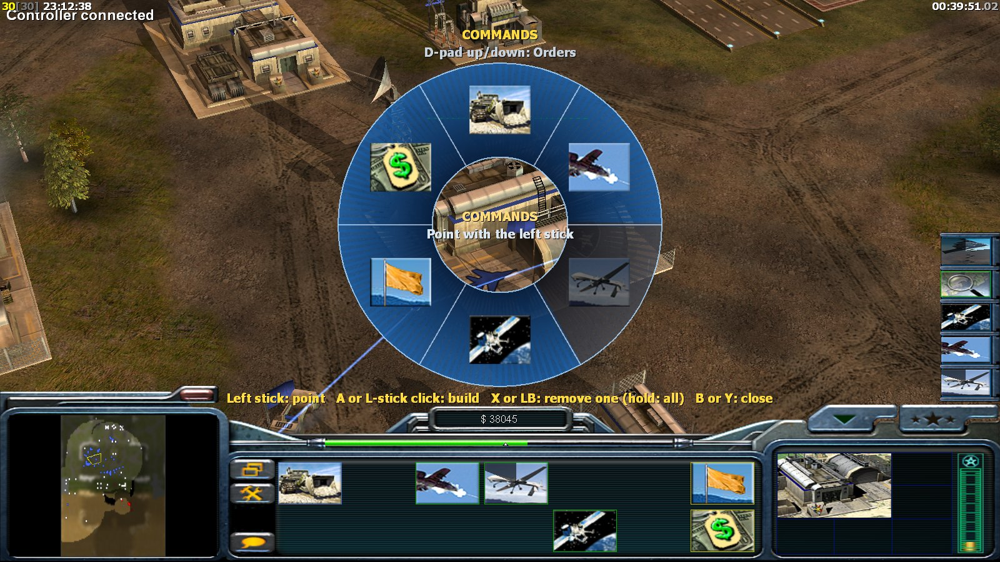
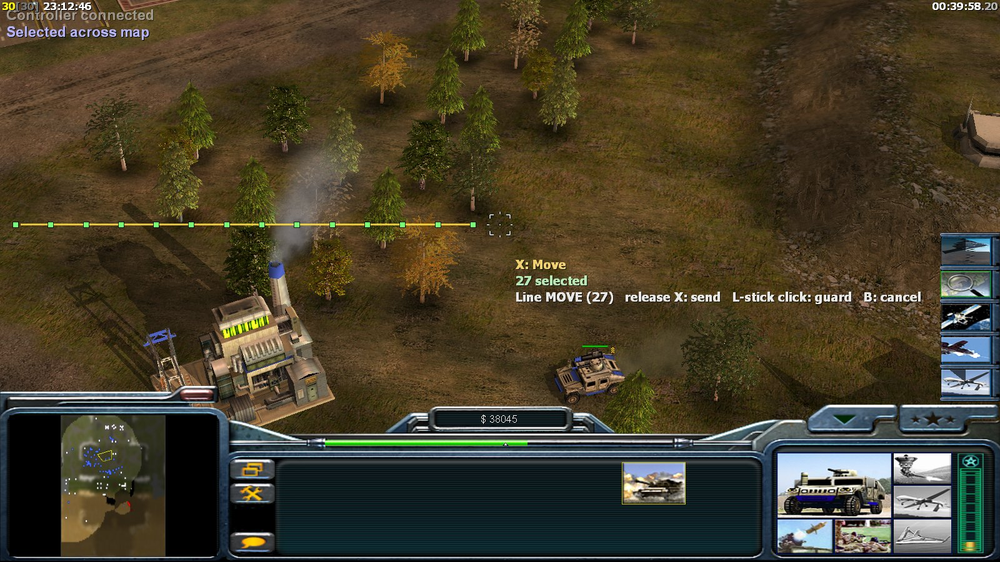
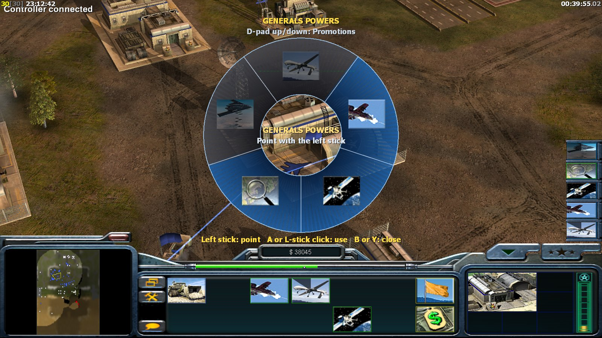
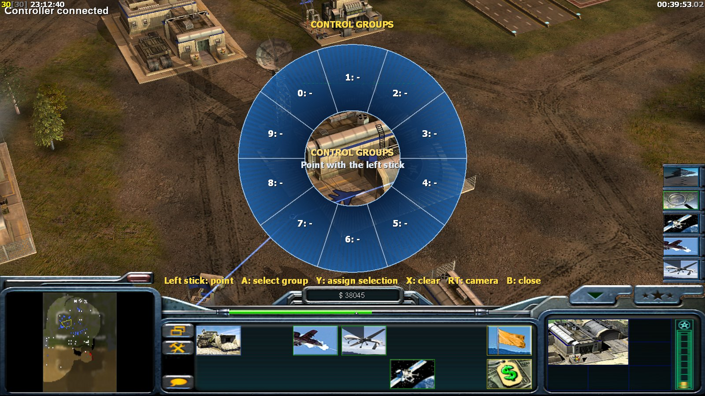
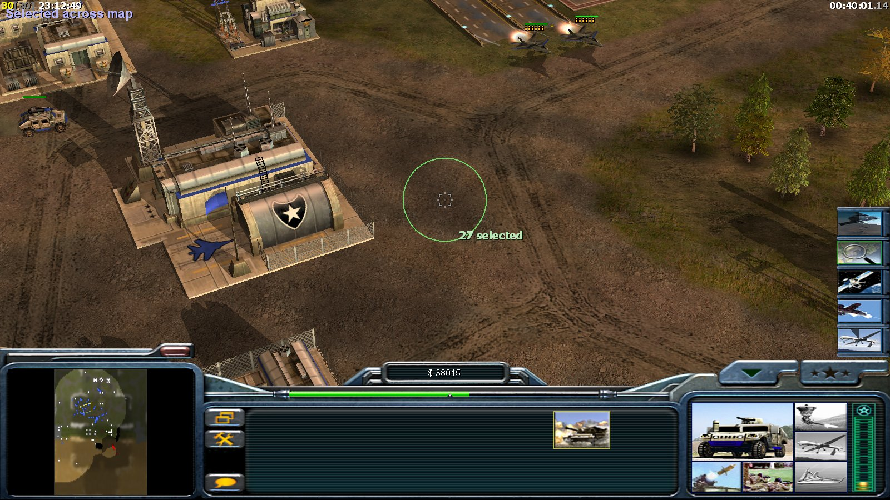

# Zero Hour Controller Mod

Play **Command & Conquer Generals: Zero Hour** with an Xbox controller, Halo Wars style: a reticle in
the middle of the screen, paint selection, radial command wheels, and the game's own menus with the
D-pad.

> **Early version, feedback wanted.** Single player and skirmish are ready to play. **Multiplayer is
> included but experimental and probably doesn't work yet**: it has only been tested with two copies
> of the game on one PC. Tell us how it went, good or bad, on the [issues page](../../issues/new/choose)
> ("Feedback" or "Bug report").

> **Credit where it's due.** This is a small addition to other people's work. The game is
> **Electronic Arts'** Command & Conquer Generals: Zero Hour, and its source code was released by EA
> under the GPL. The engine this mod is built on is the **Community Patch** (GeneralsGameCode) by
> **[TheSuperHackers](https://github.com/TheSuperHackers/GeneralsGameCode)** and its contributors.
> Almost all of the code in this repository is theirs. The controller mod adds the controller support
> only (the files listed under [What this mod adds](#what-this-mod-adds)).
>
> This mod is **not** made, supported or endorsed by Electronic Arts or by TheSuperHackers. Please
> report problems with the controller mod [here](../../issues), not to them.

## Screenshots

| | |
| --- | --- |
|  **Command wheel**: point with the left stick, A builds |  **Line move**: hold X and pan to spread the selection along a line |
|  **Generals' powers** on the D-pad |  **Control groups**: select, assign or clear groups 0-9 |
|  **Paint select**: hold A and sweep the circle over units | |

## Download and install

1. Download **`ZHController-Setup-<version>.exe`** from [Releases](../../releases).
2. Run it. It isn't code-signed, so your browser or Windows may warn about it:
   - Chrome/Edge: open the downloads list (Ctrl+J) and choose **Keep**.
   - "Windows protected your PC": **More info → Run anyway**.
3. Click **Yes** when Windows asks for permission (the game is usually in Program Files).
4. Setup finds your Zero Hour folder (the one with `INIZH.big`); if not, **Browse** to it.
5. Play with the **Zero Hour Controller** shortcut. Your normal game still starts the usual way.

Uninstall: **Settings → Apps → Zero Hour Controller Mod → Uninstall**. Setup adds only `generalszh.exe`
and a `ZH Controller` folder to the game folder; nothing of the game is replaced or changed.
A zip with a manual installer (`Install.cmd`) is on the Releases page as well.

**Needs:** Command & Conquer Generals Zero Hour **1.04**, Windows 10/11, an Xbox (XInput) controller,
and the Microsoft Visual C++ 2015-2022 Redistributable (x86), which most PCs already have.

## What you get

- **Camera:** left stick pans, right stick rotates and zooms, LT for speed.
- **Reticle:** a fixed aiming frame in the middle of the screen that shows what it is on (own, ally,
  neutral, enemy) by colour and shape, styled for your faction (USA, China, GLA).
- **Selecting:** tap A, double-tap A for all of a type on screen, hold A to paint; LB whole army,
  RB army on screen, RT to cycle unit types.
- **Orders:** X for the context order, double-tap X to guard, hold X and pan to spread units along a
  line; unload, force attack, waypoints.
- **Building and powers:** radial wheels for construction, production queues, upgrades, generals'
  powers and control groups.
- **Menus:** the game's own menus with the D-pad and A/B, including skirmish setup, map choice,
  options, save/load and the pause menu; skip the intro videos with A or Start.
- **Typing:** an on-screen keyboard for the player name, chat and the Direct Connect address.
- **Multiplayer (experimental):** LAN or VPN (Hamachi, Radmin) games between Controller Mod players,
  from the lobby to the score screen by controller, including chat. Probably doesn't work yet; see
  [Limits](#limits).
- **Settings screen:** press View in a menu (or View, then Y in a match): speeds, dead zones, button
  layout (with an emergency reset: hold both stick clicks), reticle style.
- Mouse and keyboard keep working at any time.

Full controls: `ControllerMod/release/CONTROLS.txt` (also installed with the mod).

## Limits

- **Multiplayer is experimental and probably doesn't work yet.** It has only been tested with two
  copies of the game on one PC, never between two real PCs. It only plays other players with the
  **same Controller Mod version** (normal Zero Hour and other versions are greyed out in the LAN list),
  because this program doesn't compute exactly like the normal game and the match would go out of
  sync. There is no online play. For a VPN, set both "LAN IP" and "Online IP" in Options to your VPN
  address; details in the README installed with the mod. If you try it, please
  [report](../../issues/new/choose) how far you got.
- Tested with the EA App version of Zero Hour 1.04 and a wired Xbox One controller. The Steam and
  other versions should work (Setup lets you browse to the game folder) but are less tested.
- GenTool is skipped by this program (your normal game keeps it). Other mods and total conversions
  are not supported.
- Saves made with the controller version are meant for the controller version.

## What this mod adds

The controller code is in `GeneralsMD/Code/GameEngine/Source/GameClient/Input/`
(`GameController*.cpp`, `XInputControllerDevice.cpp`), `GeneralsMD/Code/GameEngine/Include/GameClient/`
(`GameController.h`, `ControllerMath.h`), `Core/GameEngine/Include/Common/ControllerModVersion.h` and
`Core/GameEngine/Include/GameNetwork/ControllerModLan.h`, plus small, marked hooks in about 20 engine
files. Everything else is TheSuperHackers' GeneralsGameCode
(their original README is in [`UPSTREAM_README.md`](UPSTREAM_README.md)). The installer, build
scripts and tests are in [`ControllerMod/`](ControllerMod/).

- Building: [`ControllerMod/BUILDING.md`](ControllerMod/BUILDING.md)
- How it works: [`ControllerMod/DEVELOPMENT.md`](ControllerMod/DEVELOPMENT.md)

Engine bugs that also happen without the controller belong to
[TheSuperHackers/GeneralsGameCode](https://github.com/TheSuperHackers/GeneralsGameCode), following
their contribution rules.

## License

GPL-3.0, like the code it is built on: see [`LICENSE.md`](LICENSE.md). No Electronic Arts game files
(art, maps, sounds, videos) are included; you need your own copy of the game.
Command & Conquer and Generals are trademarks of Electronic Arts Inc.
